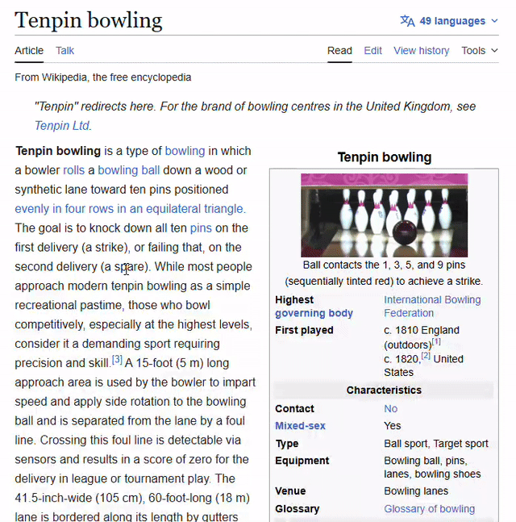
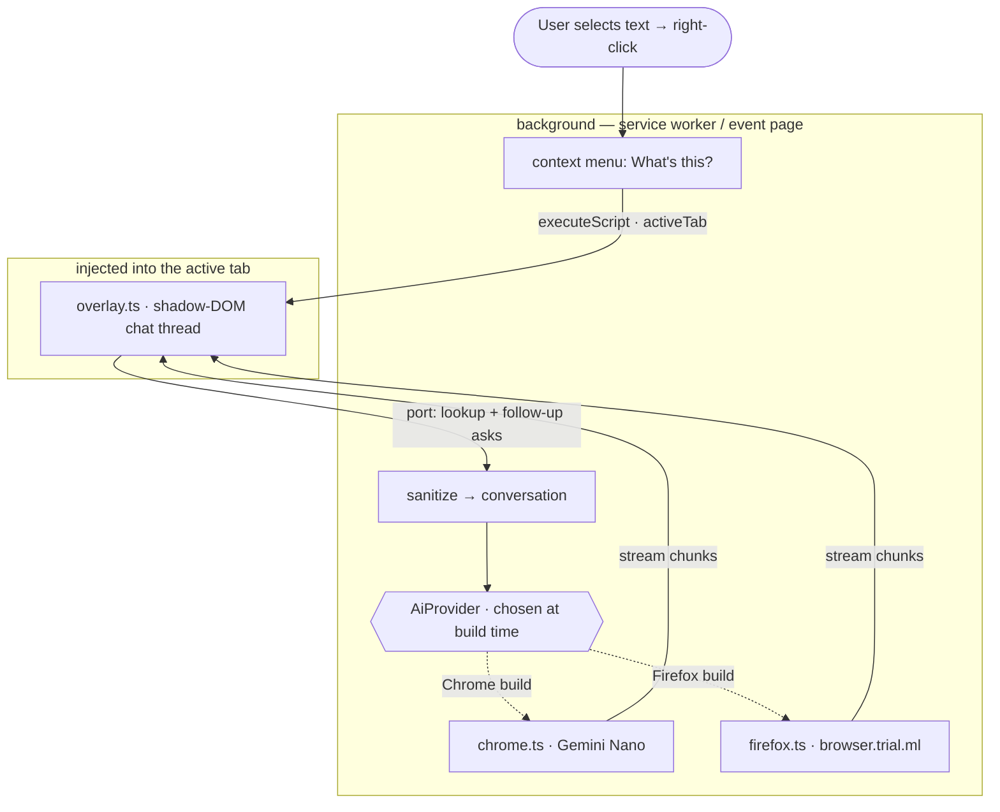

# Whatsit — What's this?

Browser extension: select any word or phrase on a page, right-click, choose
**What's this?** — and get a streamed AI explanation of what it means *in the
context of what you're reading*. "Apple" in a recipe gets the fruit; "Apple"
in tech news gets the company.

Everything runs **on-device**. No backend, no account, no data leaves the
machine — the explanation is generated by the AI built into your browser.



([mp4 version](assets/demo.mp4))

## Two browsers, one codebase

| | Chrome / Chromium | Firefox |
|---|---|---|
| On-device engine | Prompt API — **Gemini Nano** | WebExtensions ML API — **Firefox AI Runtime** |
| Global / namespace | `LanguageModel` | `browser.trial.ml` |
| Minimum version | Chrome 138+ | Firefox 142+ |
| Provider source | `utils/ai/chrome.ts` | `utils/ai/firefox.ts` |

The selection capture, the overlay, the context menu, and the message plumbing
are 100% shared. Only the AI call differs, and it lives behind one interface
(`utils/ai/types.ts`). The unused provider is tree-shaken out of each browser's
bundle, so the Chrome build never references `browser.trial.ml` and the Firefox
build never references `LanguageModel`.

> **Firefox is gated, not proven.** Chrome ships a tuned model; Firefox only
> allows models from the `Mozilla`/`Xenova` Hugging Face orgs, and `runEngine`
> may not stream. The Firefox provider is implemented and builds, but the model
> choice + latency must be validated on a real Firefox install before shipping.
> See `private/decisions/005-firefox-ai-provider.md`.

## Project layout

```
entrypoints/
  background.ts      # context menu, injection, conversation + control routing (shared)
  overlay.ts         # unlisted script: selection capture + shadow-DOM chat thread (shared)
  popup/             # toolbar popup: model manager + active-prompt selector
  options/           # full-tab settings: prompt library editor + diagnostics
utils/
  ai/
    types.ts         # AiProvider / Conversation / ModelManager — the seam
    index.ts         # picks the provider at build time (import.meta.env)
    chrome.ts        # Gemini Nano provider + manager
    firefox.ts       # browser.trial.ml provider + manager
    models.ts        # curated Firefox models (verified ONNX files)
    prompt.ts        # default system prompt + user-prompt builder
  prompts.ts         # prompt library (presets + storage, active prompt)
  settings.ts        # generation settings (temperature, top-K, max length)
  conversation.ts    # runs one turn: send → stream → done/error
  sanitize.ts        # trust-boundary input caps
  page.ts            # selection context + page darkness (pure DOM)
  control.ts         # popup/options ↔ background protocol
  control-handler.ts # serves the model-manager + diagnostics port
  storage.ts         # active model + download flags
  messages.ts        # conversation port wire protocol (typed)
types/ai.d.ts        # ambient types for the (unofficial) on-device AI APIs
public/icon/         # PNGs, auto-detected into the manifest by WXT
wxt.config.ts        # per-browser manifest generation
```

Built with [WXT](https://wxt.dev). WXT generates the manifest per browser from
`wxt.config.ts` and the entrypoints; there is no hand-written `manifest.json`.

## Architecture

Components and the build-time provider seam (the dashed branches are mutually
exclusive — each browser's bundle keeps only its own):



One lookup, end to end:

```mermaid
sequenceDiagram
    actor U as User
    participant BG as background
    participant OV as overlay (page)
    participant P as AiProvider

    U->>BG: right-click "What's this?"
    BG->>OV: executeScript(/overlay.js) + start
    OV->>OV: capture selection + ~600c context
    OV->>BG: port → word, context, title
    BG->>BG: sanitize → startConversation
    BG->>P: conversation.send(prompt)
    P-->>OV: onStatus (one-time model download)
    P-->>OV: onChunk … (streamed answer)
    BG-->>OV: done
    OV->>OV: render answer; enable follow-up input
    Note over U,OV: follow-up question → {type:ask} → another turn
```

The card is a **conversation thread**: the first answer explains the selection,
and a composer lets you ask follow-ups in the same chat (Chrome keeps a live
session; Firefox replays the message history each turn).

### Popup, options, and the prompt library

- **Popup** (toolbar icon): download the on-device model with a circular
  progress ring, see what will be downloaded, switch the **active prompt**, and
  — on Firefox — pick the model or delete the cached one. (Chrome's Gemini Nano
  is Chrome-managed: download/status only.)
- **Options** (full tab): the **prompt library** (add/edit/delete + choose
  active), **generation settings** (temperature, top-K, max length — applied by
  both engines), and a **diagnostics** panel showing model availability/params
  and device capability (cores, memory, storage, WebGPU / GPU adapter) so you
  can see what's loaded without `chrome://on-device-internals`.

The **actual** module dependency graph (generated from the code, plus the
architecture rules enforced in CI) lives in
[`docs/architecture/ARCHITECTURE.md`](docs/architecture/ARCHITECTURE.md).

## Develop

```bash
npm install            # also runs `wxt prepare` to generate types

npm run dev            # Chrome: opens a dev profile with the extension + HMR
npm run dev:firefox    # Firefox: same, via web-ext
```

`dev` launches the browser with the extension loaded and hot-reloads on save.
To load manually instead:

- **Chrome** — `chrome://extensions` → Developer mode → Load unpacked →
  `.output/chrome-mv3`
- **Firefox** — `about:debugging#/runtime/this-firefox` → Load Temporary
  Add-on → pick any file in `.output/firefox-mv3`

Then: select text on any page → right-click → **What's this?** The first-ever
lookup triggers a one-time on-device model download.

## Debugging

| What | Where |
|---|---|
| Background (SW / event page) logs | Chrome: `chrome://extensions` → *Inspect views: service worker*. Firefox: `about:debugging` → *Inspect* next to the add-on. |
| Overlay logs + DOM | The page's own DevTools (the overlay is injected into the page). |
| Source maps | Dev builds map back to the `.ts` files — breakpoints land in TypeScript. |
| Generated manifest | `.output/<target>/manifest.json` |

## Commands

| Command | Description |
|---------|-------------|
| `npm run compile` | Generate types + `tsc --noEmit` type-check (no build) |
| `npm test` | Run the unit suite once (Vitest) |
| `npm run test:watch` | Vitest in watch mode |
| `npm run build` | Production build, both browsers, into `.output/` |
| `npm run zip` / `npm run zip:firefox` | Store-ready zip per browser |
| `npm run check` | Type-check + test + build both targets (the full local gate) |
| `npm run icons` | Re-render `assets/icon.svg` → `public/icon/*.png` |

CI (GitHub Actions) runs type-check + tests + builds/zips both targets on every push.

## Tests

Unit tests (Vitest + `WxtVitest`, jsdom) live in `tests/` and cover the pure
logic, not the model:

- `prompt` / `sanitize` — prompt shape and the input-capping trust boundary
- `parse-generation` — Firefox `runEngine` output parsing (shapes + prompt strip)
- `page` — `surroundingText` clamping/centering and `pageIsDark` luminance
- `lookup` — orchestration (status → chunks → done, error paths, caps applied)
- `provider` — the `AiProvider` contract and Chrome's "AI unavailable" path

What's deliberately **not** unit-tested: the actual on-device model output
(Gemini Nano / `browser.trial.ml`). Mocking it would only test the mock — model
quality is the manual gate (`private/decisions/005`).

## Known limits (v0.1)

- Top-frame selections only (no iframes).
- Output language is English (both engines' English path).
- Chrome: needs Gemini Nano hardware (~22 GB free disk, 4 GB VRAM **or** 16 GB
  RAM). Firefox: needs the AI runtime model download on first use.
- Firefox model quality + streaming are unvalidated (see the gate note above).
