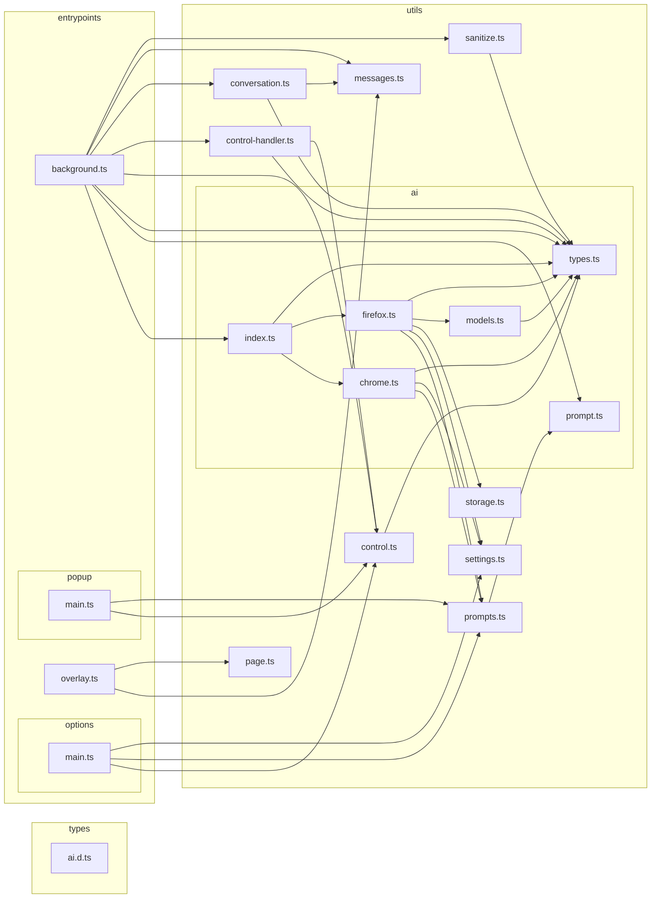

# Whatsit architecture

Two kinds of picture, on purpose:

- **Intended architecture** (the story) — hand-drawn, lives in the [README](../../README.md#architecture). The runtime flow and the provider seam.
- **Actual module graph** (ground truth) — *generated from the code* by
  dependency-cruiser, below. It can't drift, because it's regenerated from the
  real imports.

## Module dependency graph (generated)

Regenerate with `npm run dep:graph` (writes `dependency-graph.mmd`); the
snapshot below is that output. Note that `background.ts` reaches the AI layer
**only** through `utils/ai/index.ts` — the providers are never imported directly.

## Enforced boundaries

`npm run dep:check` (run in CI) fails the build on either of these — so the
architecture is guaranteed, not just documented:

| Rule | What it guarantees |
|------|--------------------|
| `no-circular` | No import cycles anywhere — keeps modules independently readable and tree-shakeable. |
| `ai-providers-via-index` | `utils/ai/chrome.ts` and `utils/ai/firefox.ts` are reachable **only** through `utils/ai/index.ts`. Nothing else may import a provider directly, so the build-time pick (`import.meta.env.FIREFOX`) keeps the unused engine out of each browser's bundle. |

Rules live in [`.dependency-cruiser.cjs`](../../.dependency-cruiser.cjs).

## Why this shape

The codebase is deliberately a **deep seam over a shallow surface**: everything
browser-specific hides behind the three-method `AiProvider` interface, so a
reader can follow the whole flow (`background → runLookup → provider → overlay`)
without ever opening Gemini Nano or `browser.trial.ml` code. That's the highest-
leverage move for keeping the project readable without AI assistance — fewer,
deeper modules beat many shallow ones.
